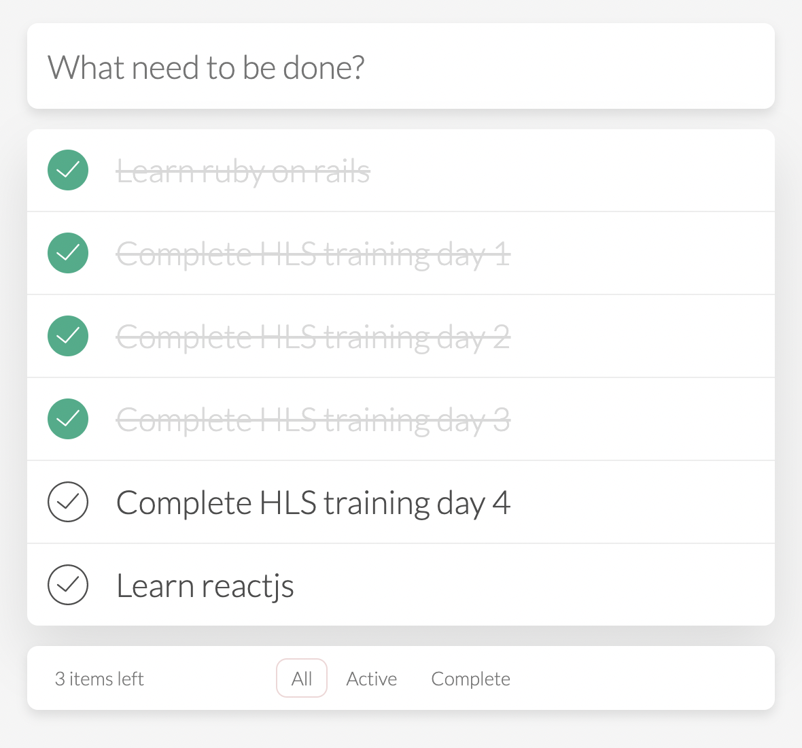

# HLS - Training day 4

# React Component’s Lifecycle Practice

Congrats!!!!
You learn reactjs in 3 days. You will practice all knowledge in 3 day and complete first challenge

# Todo Single Serving Website
This is a ReactJS evaluation test to create a single serving website that displays task list for user to do.
Create a react project by [Create react app](https://reactjs.org/docs/create-a-new-react-app.html) and apply all what you did in 3 days in here

## Requirements

- On top: the user can create new task in first input
- On body:
+ This app will display a list tasks for the user to do.
+ The user will tick to complete or untick revoke complete the task.
- On footer: the use can seting display all task or only complete/uncomplete task

## Reference
- **Learning Resources**
